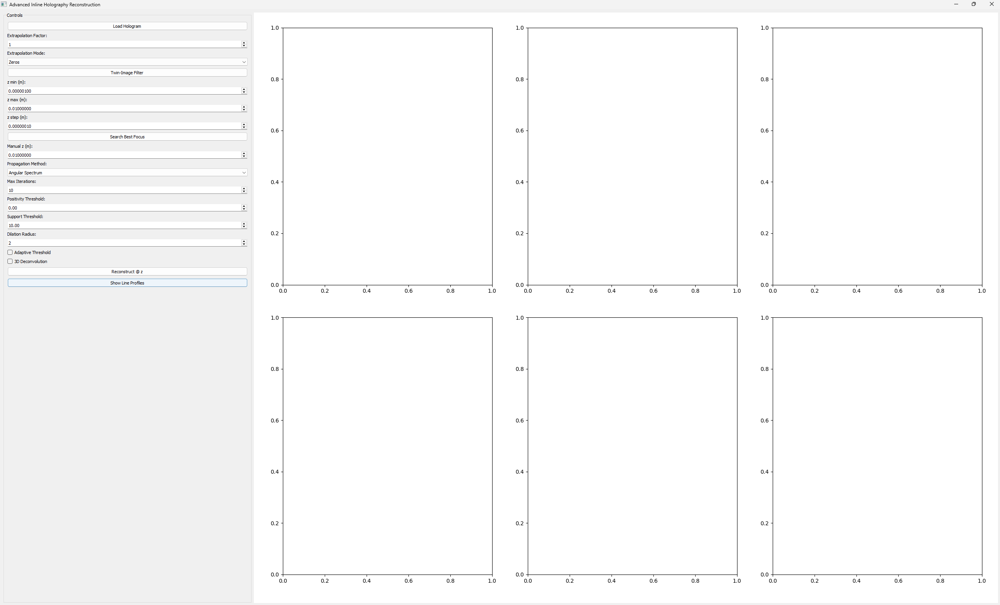

# Inline Holography Reconstruction


A **PyQt5-based interactive GUI** for **inline lensless holography reconstruction**.  
Supports both **direct** (Angular Spectrum / Fresnel) and **iterative** (Gerchberg–Saxton / HIO) phase retrieval, with autofocus, twin-image suppression, adaptive constraints, metrics, and publication-ready visualizations.

---

## ✨ Key Features

### 1. Hologram Input & Preprocessing
- Load holograms in **PNG, JPG, BMP, TIF/TIFF** formats.
- **Extrapolation**: Zero or random padding to recover missing boundaries.
- Optional **Twin-Image Filtering** via Fourier sideband filtering.

### 2. Direct Reconstruction
- **Angular Spectrum** or **Fresnel propagation**.
- Adjustable:
  - Wavelength
  - Field-of-view (FOV) size
  - Propagation distance `z`

### 3. Iterative Phase Retrieval
- Methods: **Gerchberg–Saxton (GS)** and **Hybrid Input-Output (HIO)**.
- Constraints:
  - **Positivity enforcement** (amplitude ≥ 0)
  - **Finite support mask** (percentile, Otsu, or fixed threshold)
  - **Adaptive support threshold** with morphological dilation
- Adjustable iteration count and HIO `β` parameter.

### 4. Autofocus
- Brute-force scan over a `z` range.
- Focus metrics:
  - **Unwrapped phase range**
  - **Laplacian variance** (amplitude sharpness)
- Auto-updates reconstruction `z`.

### 5. Visualization
- **3×4 publication-ready grid**:
  - Row 1: Direct — Amplitude / Wrapped / Unwrapped / Fourier magnitude
  - Row 2: Iterative — Amplitude / Wrapped / Unwrapped / Fourier magnitude
  - Row 3: Differences — ΔAmplitude / ΔWrapped / ΔUnwrapped / Iterative phase histogram
- **Linked color scales** for fair comparison.
- **Interactive line profiles**: Click anywhere to view amplitude & phase profiles through that point.

### 6. Quantitative Metrics
- RMSE (amplitude)
- SSIM (amplitude)
- Phase correlation (unwrapped phase)
- Support coverage
- Valid mask coverage

### 7. Export
- Save figure as PNG/TIFF.
- Optionally save:
  - Reconstructed fields (`.npz`)
  - Parameters (`.json`)
  - Metrics table (`.csv`)

---

## 📸 Screenshots

**Main Application:**


**Interactive Profiles:**


---

## 🛠 Installation

### Prerequisites
- Python **3.8+**
- `git`
- Recommended: virtual environment (`venv`)

### Clone & Install
```bash
cd C:\Users\aliad\github
git clone https://github.com/aliaslandemir/lenslessholography.git
cd lenslessholography

# Create virtual environment
python -m venv .venv
.venv\Scripts\activate  # Windows
# source .venv/bin/activate  # Linux/Mac

# Install dependencies
pip install -r requirements.txt
